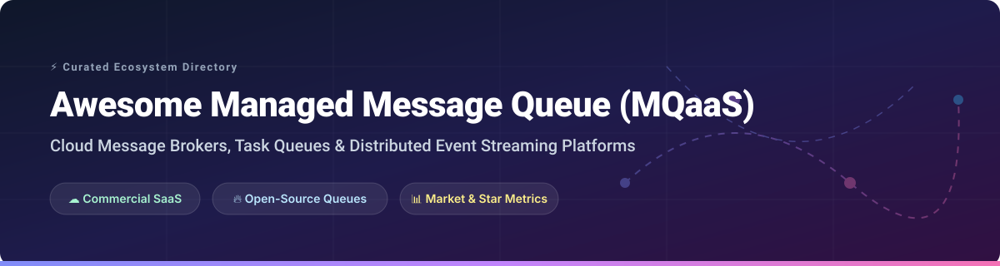

# ⚡ Awesome Managed Message Queue (MQaaS) &amp; Open-Source Queues

  

  
  
  
  
  

> **A curated directory of commercial Message Queuing as a Service (MQaaS) platforms, serverless message brokers, distributed task queues, and open-source messaging projects.**

---

## 📚 Table of Contents

- [📈 Market Overview & Sector Dynamics](#-market-overview--sector-dynamics)
- [☁️ Managed SaaS Platforms (MQaaS)](#️-managed-saas-platforms-mqaas)
- [🔥 Open-Source GitHub Projects](#-open-source-github-projects)
  - [🚀 High-Throughput Streaming & Brokers](#-high-throughput-streaming--brokers)
  - [⚙️ Task Queues & Background Processing](#️-task-queues--background-processing)
  - [☸️ Kubernetes-Native & Cloud Queuing](#️-kubernetes-native--cloud-queuing)
  - [🛠️ Additional Open-Source Options](#️-additional-open-source-options)
- [🤝 How to Contribute](#-how-to-contribute)
- [💖 Support & Sponsorship](#-support--sponsorship)
- [⚠️ Enterprise Best Practices & Disclaimer](#-enterprise-best-practices--disclaimer)
- [⭐ Star History](#-star-history)

---

## 📈 Market Overview & Sector Dynamics

> 💡 **Market Size & Structure**: The global Message Queue and Middleware market is estimated at **$6.5 Billion to $8.2 Billion (2026)** and is projected to reach **$14.5 Billion by 2030** (CAGR ~12.5%). The market is **moderately fragmented**: hyper-scale cloud providers (AWS, Azure, GCP) command the largest volume share for general-purpose serverless queuing, while specialized streaming leaders (Confluent, Redpanda) and niche MQaaS hosts dominate high-throughput enterprise event streaming.

---

## ☁️ Managed SaaS Platforms (MQaaS)

Below is a comparison of top commercial Message Queuing as a Service (MQaaS) platforms sorted by **Company Size / Valuation / Revenue** in descending order.

| Platform | Company Valuation / Revenue Size | Starting Pricing | Free Tier / Trial Limit | Key Features & Best Use Case |
| :--- | :--- | :--- | :--- | :--- |
| **[Azure Service Bus](https://azure.microsoft.com/en-us/products/service-bus/)** 🏢 | **~$3.0 Trillion** (Microsoft Market Cap) | **$0.05 per 1 million operations** (Standard tier) / **$10/day** (Premium unit) | **13 Million operations / month** for 12 months (Free Account) | Enterprise message broker featuring AMQP 1.0, queues, topics, message sessions, and DLQ. Best for Azure enterprise integration. |
| **[Amazon SQS](https://aws.amazon.com/sqs/)** ☁️ | **~$1.8 Trillion** (AWS / Amazon Market Cap) | **$0.40 per 1 million requests** (Standard) / **$0.50 per 1M** (FIFO) | **1 Million requests per month** (Forever Free Tier) | Standard & FIFO queues, visibility timeouts, dead-letter queues (DLQ), and long polling. Best for AWS-native decoupled architectures. |
| **[Amazon MQ](https://aws.amazon.com/amazon-mq/)** 📦 | **~$1.8 Trillion** (AWS / Amazon Market Cap) | **~$0.025 per hour** (~$18/mo for `mq.t3.micro` instance) | **750 hours/month** `mq.t3.micro` instance for **6 months** | Managed ActiveMQ and RabbitMQ brokers with built-in DLQ, retry configurations, and JMS compliance. Best for migrating legacy brokers to cloud. |
| **[Google Cloud Pub/Sub](https://cloud.google.com/pubsub)** 🌐 | **~$1.7 Trillion** (Google / Alphabet Market Cap) | **$40.00 per TiB** of data throughput | **10 GiB message throughput per month** (Forever Free Tier) | Global scale at-least-once pub/sub delivery with dead letter topics and retention policies. Best for GCP-native real-time pipelines. |
| **[Apache Kafka Cloud (Confluent Cloud)](https://www.confluent.io/confluent-cloud/)** 🐿️ | **$11.0 Billion** (Acquired by IBM) | **$0.11 per GB** ingested + cluster base (~$0.60/hr for Standard) | **$400 free credits** valid for 30 days (Free Trial) | Enterprise managed Kafka, Flink stream processing, connectors, and Schema Registry. Best for high-throughput enterprise event streaming. |
| **[Redpanda Cloud](https://redpanda.com/)** 🐼 | **$1.0 Billion** (Valuation, Series D) | **$0.08 per GB** transferred (Serverless tier) | **$100 free credits** for 30 days (Free Trial) | Kafka-API compatible streaming platform written in C++ (no JVM, no Zookeeper). Best for ultra-low latency high-performance streaming. |
| **[CloudAMQP (RabbitMQ Cloud)](https://www.cloudamqp.com/)** 🐰 | **~$30.5 Million** (Annual Recurring Revenue, 84codes) | **$19.00 / month** ("Tough Tiger" paid tier) | **1 Million messages/month** on shared vhost ("Little Lemur" Forever Free) | Managed RabbitMQ supporting AMQP 0-9-1, MQTT, STOMP, and WebSockets with flexible exchange routing. Best for turn-key RabbitMQ hosting. |
| **[IronMQ (Iron.io)](https://www.iron.io/)** 🛠️ | **~$17.4 Million** (Total Venture Funding Raised) | **$25.00 / month** (Developer starter tier) | **14-day free trial** (up to 10M API requests) | Cloud-native message queuing service supporting push/pull queues, long polling, and event triggers. Best for cloud task distribution. |
| **[Upstash QStash](https://upstash.com/qstash)** ⚡ | **~$12.0 Million** (Total Venture Funding Raised) | **$1.00 per 100,000 requests** (Pay-as-you-go) | **500,000 requests per month** (Forever Free Tier) | Serverless HTTP-based message queue and background job scheduler with retries, delay queues, and deduplication. Best for serverless/edge functions. |

---

## 🔥 Open-Source GitHub Projects

Sorted by **GitHub Stars_Count** in descending order. Click on any Stars_Badge to visit the repository stargazers page.

### 🚀 High-Throughput Streaming & Brokers

- **[Apache Kafka](https://github.com/apache/kafka)**  ⚡  
  **The de facto distributed event streaming platform** (Apache-2.0). Distributed, fault-tolerant, high-throughput pub/sub event log with Kafka Connect ecosystem and DLQ patterns.
- **[NATS](https://github.com/nats-io/nats-server)**  ☁️  
  **Cloud-native high-performance messaging system** (Apache-2.0). Ultra-lightweight pub/sub messaging engine with JetStream persistence, message redelivery, and dead-lettering.
- **[Apache Pulsar](https://github.com/apache/pulsar)**  🌌  
  **Multi-tenant distributed messaging and streaming platform** (Apache-2.0). Built-in multi-tenancy, geo-replication, tiered storage, negative acknowledgements (nack), and Dead Letter Topics (DLT).
- **[RabbitMQ](https://github.com/rabbitmq/rabbitmq-server)**  🐰  
  **The standard for open-source message queuing** (MPL-2.0). Advanced AMQP, MQTT, STOMP routing with Dead Letter Exchanges (DLX), message TTL, and queue priority controls.
- **[NSQ](https://github.com/nsqio/nsq)**  📡  
  **Real-time distributed messaging platform in Go** (MIT). Simple, fault-tolerant, high-throughput messaging without single points of failure.
- **[ZeroMQ (libzmq)](https://github.com/zeromq/libzmq)**  🏎️  
  **High-performance asynchronous messaging library** (MPL-2.0). Brokerless socket-based messaging library for low-latency custom concurrency patterns.
- **[Apache ActiveMQ](https://github.com/apache/activemq)**  🏛️  
  **Enterprise open-source multi-protocol message broker** (Apache-2.0). Full JMS compliance with AMQP, STOMP, MQTT support, and DLQ handling.
- **[Apache ActiveMQ Artemis](https://github.com/apache/activemq-artemis)**  🎯  
  **High-performance non-blocking message broker** (Apache-2.0). JMS 2.0 compliant broker architecture designed for maximum throughput.

### ⚙️ Task Queues & Background Processing

- **[Celery](https://github.com/celery/celery)**  🐍  
  **Distributed task queue for Python** (BSD-3-Clause). Asynchronous task execution with exponential backoff retries and dead-letter queues.
- **[Sidekiq](https://github.com/sidekiq/sidekiq)**  💎  
  **Simple, efficient background processing for Ruby** (LGPL-3.0). Redis-backed job processing with backoff retries and DeadSet dead-job queues.
- **[RQ (Redis Queue)](https://github.com/rq/rq)**  🗃️  
  **Lightweight Python task queue powered by Redis** (BSD-2-Clause). Simple job scheduling with built-in FailedQueue exception routing.
- **[KEDA](https://github.com/kedacore/keda)**  📈  
  **Kubernetes Event-driven Autoscaling** (Apache-2.0). Drive container autoscaling (0 to N) based on message queue depth and stream lag.
- **[Beanstalkd](https://github.com/beanstalkd/beanstalkd)**  🫘  
  **Fast, general-purpose work queue protocol** (MIT). In-memory job queue with tube routing, delayed jobs, and priority queues.
- **[BullMQ](https://github.com/taskforcesh/bullmq)**  🐂  
  **Fast, robust background queue for Node.js and TypeScript** (MIT). Redis Streams-backed task queue with retries, parent-child job flows, and DLQ.
- **[Hatchet](https://github.com/hatchet-dev/hatchet)**  🪓  
  **Distributed task orchestrator & queue** (MIT). Replacement for traditional queues with concurrency limits, DAG workflows, and low-latency retries.
- **[Dramatiq](https://github.com/Bogdanp/dramatiq)**  🎭  
  **Fast Python background task processing library** (LGPL-3.0). High-reliability task queue with automatic retries and dead-letter queues.

### ☸️ Kubernetes-Native & Cloud Queuing

- **[KubeMQ](https://github.com/kubemq-io/kubemq-community)**  ☸️  
  **Kubernetes-native message broker and message queue** (Apache-2.0). Enterprise-grade queues, pub/sub, RPC, and persistence in a single operator.
- **[NATS JetStream](https://github.com/nats-io/nats-server)**  🛩️  
  **Persistence engine for NATS** (Apache-2.0). Built-in streaming persistence with deduplication, redelivery, and dead-lettering for K8s.

### 🛠️ Additional Open-Source Options

- **[Redis Pub/Sub & Streams](https://github.com/redis/redis)**  🔴 — High-performance in-memory data store providing pub/sub channels and append-only Redis Streams for consumer groups.
- **[Apache Qpid](https://github.com/apache/qpid-broker-j)**  🏹 — Enterprise AMQP 1.0 messaging broker built in Java with transaction support.
- **[Laravel Horizon](https://github.com/laravel/horizon)**  🌅 — Beautiful real-time dashboard and queue manager for Redis-powered Laravel queues.
- **[Disque](https://github.com/antirez/disque)**  💿 — In-memory distributed job queue crafted by the creator of Redis.
- **[Kombu](https://github.com/celery/kombu)**  🌾 — Messaging library for Python designed to make messaging as easy as possible.
- **[Gearman](https://github.com/gearman/gearmand)**  ⚙️ — Generic application framework to farm out work to other machines or processes.
- **[WakaQ](https://github.com/wakatime/wakaq)**  ⏱️ — Background task queue for Python backed by Redis, built for efficiency.

---

## 🤝 How to Contribute

Contributions are welcome and appreciated! Follow these steps to submit a contribution:

1. **Fork** this repository.
2. Add or update entries in `README.md` keeping formatting consistent with existing tables.
3. Ensure open-source additions include GitHub link, Stars_Badge, license, and brief description.
4. For SaaS submissions, provide verified starting pricing and free tier/trial limits.
5. Create a Pull Request with a clear description of your changes.

---

## 💖 Support & Sponsorship

If you found this curated list helpful, please consider supporting the project:

- ⭐️ **Star** this repository to increase visibility.
- 🔀 **Fork** and contribute new MQaaS products or open-source queue tools.
- 📢 **Share** this list with fellow developers, cloud architects, and platform teams.
- ☕ **Sponsor / Buy me a coffee**: Support ongoing maintenance on the [GitHub Sponsors Dashboard](https://github.com/sponsors/ishandutta2007).

---

## ⚠️ Enterprise Best Practices & Disclaimer

- **Dead-Letter Queue (DLQ) Configuration**: Never run message queues in production without configuring a Dead-Letter Queue. DLQs isolate poison messages that fail repeatedly, preventing queue blockage and data loss.
- **Exponential Backoff with Jitter**: Implement exponential backoff when retrying failed message processing to avoid overwhelming downstream services during outages (thundering herd problem).
- **Poison Message Guardrails**: Set strict maximum retry thresholds (e.g., max 3-5 retries) before sending messages to DLQ and trigger automated alerts on DLQ depth anomalies.
- **Licensing Considerations**: Verify licenses before deploying: RabbitMQ (MPL-2.0), Kafka/Pulsar/NATS/KEDA (Apache-2.0), Celery (BSD-3-Clause), BullMQ/Beanstalkd/NSQ (MIT), Sidekiq/Dramatiq (LGPL-3.0).
- **Community Disclaimer**: This directory is community-curated for informational purposes.

---

## ⭐ Star History

---

  <b>Made for backend engineers, platform teams, and cloud architects seeking message queuing sovereignty.</b>

